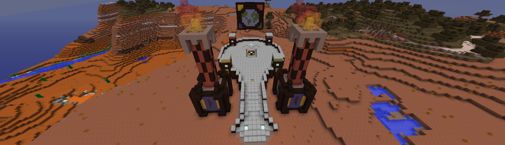

# Projecte MegaCat.cat

---

## Els Orígens

Durant els anys 2011-2016 hi va haver diversos servidors catalans; entre els més famosos hi havia _minecraft.cat_ i _minecat.cat_.
Centenars de jugadors van jugar en una època daurada del Minecraft en català. Aquests servidors, com molts servidors petits, depenien de l’esforç voluntari d’administradors i moderadors per tal de poder oferir experiències de qualitat. Es creaven esdeveniments que aglomeraven grans quantitats de jugadors, es desenvolupava una economia que incentivava la interacció entre usuaris i es permetia la formació de cercles socials o comunitats dins dels servidors.

Tot i així, cap a l’any 2017 hi va haver un buit de servidors catalans de supervivència. Entràvem en l’època fosca de Minecraft, quan l’interès pel joc es trobava en un mínim històric. Tots els servidors públics van tancar a causa de la baixa quantitat de jugadors i de la falta d’administradors disposats a empènyer un projecte amb un alt cost de temps.

En aquest context, un grup de jugadors, format per en JoniMega i l’AstroCat93, va decidir continuar aquest llegat creant **MegaCat.cat**.

## El primer servidor MegaCat

En JoniMega havia estat administrador de _Skacraft_ i _MiniCat_. L’AstroCat93 havia estat youtuber promovent servidors catalans. Amb aquesta petita experiència van poder impulsar un servidor, desenvolupant una proposta d’aventura i supervivència.

El món de **MegaCat** presentava nous reptes. El mapa era ple de tresors, masmorres i proves. Cada setmana hi havia nous esdeveniments creats pels administradors. També hi havia una economia que incentivava la gent a aconseguir recursos, diners i, finalment, objectes que no es podien obtenir de manera convencional.

El servidor va atreure desenes de jugadors. Va ser un servidor actiu, amb creadors catalans generant contingut a YouTube i participant en fòrums catalans.

El servidor va estar actiu des del desembre del 2017 fins a l’agost del 2018.

## El Retorn

El projecte **MegaCat.cat**, en l’actualitat, és més petit, però no necessàriament menys important.
Avui dia, el projecte intenta crear nous servidors semipúblics; és a dir, petits grups d’amics només amb invitació.

La segona part del projecte és promoure i documentar els servidors catalans.