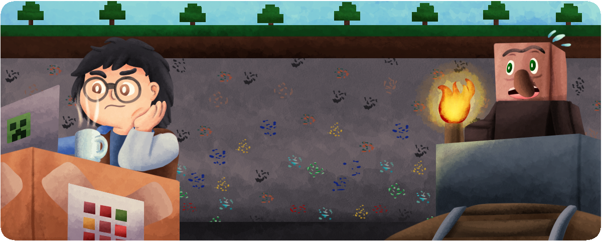

Benvingut a la pàgina web de MegaCat. 

MegaCat ofereix servidors públics i semipúblics per la comunitat catalana, on la llengua principal d'ús usual als servidors és el Català.
Aquí trobaràs tota la informació de com accedir als diversos servidors de MegaCat i les instruccions de com instal·lar els mods necessaris o opcionals. 

## Llistat de Servidors MegaCat

Llistat de servidors que MegaCat gestiona i ofereix gratuïtament. 

La categoria de Mods defineix si el servidor requereix tenir mods per tal accedir-hi. Servidors que es puguin accedir sense mods no necessàriament implica que el servidor tingui internament mods per gestionar còpies de seguretat o com mods que puguin modificar la generació del món o mecàniques del joc.

| Servidor                                                    | Versió         | Mods | Actiu |
|:------------------------------------------------------------|:---------------|:-----|:------|
| [Vanilla]({{site.baseurl}}/docs/servidor_vanilla/)          | 1.21.1         |  ❌  |  ❌   |
| [Create]({{site.baseurl}}/docs/servidor_create/)            | 1.21.1         |  ✅  |  ❌   |
| [CraftMine]({{site.baseurl}}/docs/servidor_craftmine/)      | 25w14craftmine |  ❌  |  ❌   |

## Llistat de Servidors Catalans externs

Llistat de servidors catalans externs. MegaCat no gestiona cap d'ells, però volem igualment promocionar servidors catalans.

| Servidor                                                    | Versió         | Mods | Actiu |
|:------------------------------------------------------------|:---------------|:-----|:------|
| [CubeCat](https://www.cubecat.cat)                          | 1.21.3         |  ❌  |  ✅   |
| [Terracraft](https://www.cubecat.cat)                       | 1.19.1         |  ❌  |  ❌   |
| [Torneig Extreme](https://www.torneigextreme.ca)            | 1.20.1         |  ❌  |  ✅   |
